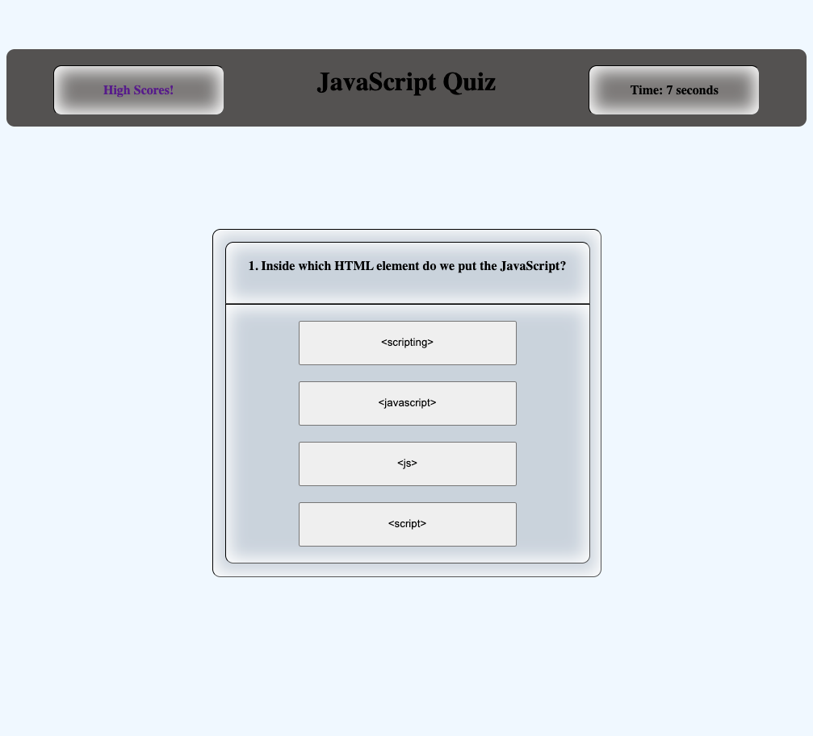
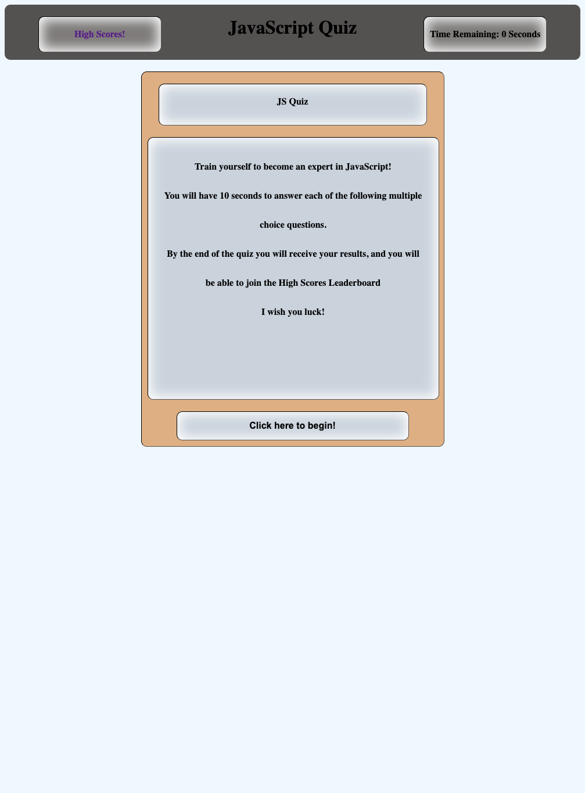

# challenge-quiz

## Description

I have created a JavaScript Quiz to test my abilities on the subject. It is a timed multiple choice quiz, wherein the user has 10 seconds to answer each question. Upon completing the quiz, the user will be given a score.

## Installation

N/A

## Usage

The user will be able to test their own knowledge in the field of JavaScript as they answer the questions within. The result will be recorded should the user wish to join the leaderboard section.

## Screenshot

## Links

https://zbichsel.github.io/challenge-quiz

https://www.github.com/zbichsel/challenge-quiz

## Credits

N/A

## Contact Me

If you have any questions, please contact me at: biksel09@gmail.com

## License

Please refer to the LICENSE in the repository.